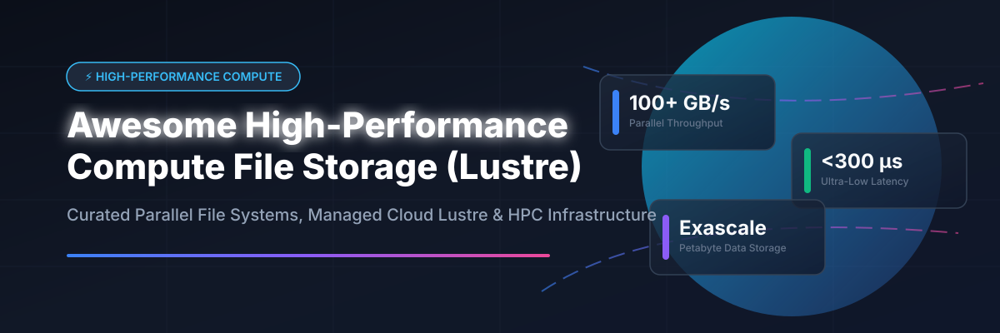

# Awesome-High-Performance-Compute-File-Storage-Lustre ⚡ 🗄️

  

  
  
  
  
  
  

---

## 🌟 Top High-Performance Compute File Storage (Lustre) Ecosystem 🚀

**Curated List of Commercial HPC File Storage Platforms & Open-Source Parallel File Systems** 🗄️  
*Focused on Lustre, Parallel File Systems, High-Performance Compute Storage, AI/ML Data Pipelines, Burst Buffer, Multi-Tier Storage, Exascale Systems & Self-Hosted HPC Infrastructure* ⚡

**Last updated: October 2026** 📅

---

### 📌 Overview & SEO Summary 🔍

Welcome to the ultimate curated directory of **high-performance compute file storage platforms**, **open-source parallel file systems**, and **Lustre-compatible enterprise storage solutions**. Whether you are deploying enterprise-grade commercial platforms (such as *Amazon FSx for Lustre*, *Azure Managed Lustre*, *DDN EXAScaler*, and *Weka.io*) for ultra-low latency AI model training, or self-hosting production-proven open-source parallel file systems (like *MinIO*, *SeaweedFS*, *Ceph*, *JuiceFS*, *OpenZFS*, and *BeeGFS*), this comprehensive guide covers category leaders, parallel I/O architectures, distributed metadata engines, and scalable storage infrastructure.

**Key Market & Technical Highlights:** 💡

- **Lustre Parallel File System:** The premier **open-source parallel file system for HPC**, powering over **60%+ of TOP500 supercomputers** with **hundreds of GB/s throughput** and **exascale capacity**. ⚡
- **Managed Cloud Parallel Storage:** Services like **Amazon FSx for Lustre** and **Azure Managed Lustre** provide **fully managed Lustre clusters** with **sub-millisecond latencies**, seamless **Amazon S3 / Azure Blob integration**, and zero storage administration overhead. ☁️
- **Next-Gen Open-Source Storage:** High-speed distributed engines like **MinIO**, **SeaweedFS**, **JuiceFS**, and **DAOS** combine POSIX compatibility with high-performance object engines to serve large-scale AI/ML data pipelines. 🚀

---

## 📑 Table of Contents 📜

- [🏢 SaaS & Commercial Platforms](#-saas--commercial-platforms)
- [🔓 Open-Source GitHub Projects](#-open-source-github-projects)
- [🛠️ How to Contribute](#%EF%B8%8F-how-to-contribute)
- [📊 Star History](#-star-history)
- [🤝 Support & Sponsorship](#-support--sponsorship)
- [⚠️ Disclaimer](#%EF%B8%8F-disclaimer)

---

## 🏢 SaaS / Commercial Platforms 🌐

**Market Context:** The global High-Performance Computing (HPC) and enterprise data storage market is estimated at **$59 Billion – $65 Billion**, with the parallel file system sub-segment expanding rapidly to support generative AI model training and exascale simulation workloads. The market exhibits **moderate fragmentation**, balancing dominant cloud hyperscalers (Microsoft, AWS) and legacy storage giants (IBM, Dell, NetApp) alongside specialized parallel storage pioneers (DDN, WEKA, VAST Data, Qumulo). 📊

| SaaS / Commercial Platform | Company / Owner | Valuation / Market Cap | Standard Edition Starting Price | Free Tier / Free Trial Limits | Description |
| :--- | :--- | :--- | :--- | :--- | :--- |
| **[Azure Managed Lustre](https://azure.microsoft.com/en-us/products/managed-lustre/)** 🔷 | Microsoft | ~$3.90 Trillion | **$0.25/GiB-month** (Premium tier) | **30-day free trial** ($200 credit via Azure Free Account) | **Azure-native managed Lustre** — **Fully managed parallel file system** . **High-throughput for HPC and AI workloads** . **Blob Storage integration** . ⚡ |
| **[Amazon FSx for Lustre](https://aws.amazon.com/fsx/lustre/)** ☁️ | Amazon | ~$2.0 Trillion | **$0.145/GB-month** (SSD); **$0.025/GB-month** (HDD) | **No free tier** (Pay-as-you-go from first use) | **AWS-native managed Lustre** — **Fully managed parallel file system** . **Sub-millisecond latencies** and **hundreds of GB/s throughput** . **S3 integration for data repositories** . 🚀 |
| **[IBM Spectrum Scale](https://www.ibm.com/products/spectrum-scale)** 🏢 | IBM | ~$200 Billion | **$0.070/GB-month** (Cloud Marketplace estimation) | **30-day evaluation license** | **Enterprise parallel file system** — **Formerly GPFS** . **Scales to exabytes** . **Multi-protocol support** . 🗄️ |
| **[Dell PowerScale Cloud](https://www.dell.com/en-us/dt/storage/powerscale.htm)** 🔷 | Dell Technologies | ~$60 Billion | **$0.065/GB-month** (APEX storage subscription) | **Interactive virtual lab demo** | **Enterprise NAS in the cloud** — **OneFS operating system** . **Scales to 100+ PB** . 📦 |
| **[NetApp Cloud Volumes](https://cloud.netapp.com/)** 🔷 | NetApp | ~$20 Billion | **$0.10/GB-month** (Cloud Volumes ONTAP PAYGO) | **30-day trial via sales request** | **Enterprise NAS in the cloud** — **Full ONTAP feature set** . **Multi-cloud support** . 🌐 |
| **[Vast Data Cloud](https://www.vastdata.com/)** 🌊 | Vast Data | ~$9.1 Billion | **$0.15/GB-month** (Capacity software subscription) | **Guided sandbox demo** | **Disaggregated storage architecture** — **All-flash, exabyte-scale** . **AI/ML and HPC optimization** . 🌊 |
| **[DDN EXAScaler Cloud](https://www.ddn.com/)** 🟢 | DDN | ~$5.0 Billion | **$0.08/GB-month** (Software & support subscription) | **Custom POC / Testbed demo** | **Enterprise Lustre platform** — **Exascale-class performance** . **AI/ML optimization** . **Used by TOP500 supercomputers** . 🟢 |
| **[Weka.io](https://www.weka.io/)** ⚡ | WekaIO | ~$1.6 Billion | **$0.10/GB-month** (Cloud deployment) | **Hosted evaluation sandbox** (Request via info@weka.io) | **Software-defined parallel file system** — **Hardware-agnostic** . **Scales to hundreds of petabytes** . **10s of millions of IOPS** . **<300 microsecond latency** . ⚡ |
| **[Qumulo File Fabric](https://qumulo.com/)** 📊 | Qumulo | ~$1.2 Billion | **$0.0263/TB-hour** (~$0.019/GB-month AWS PAYG) | **14-day cloud trial** | **Scale-out file storage** — **Petabyte-scale** with **real-time analytics** . **API-first architecture** . 📊 |
| **[Panasas ActiveStor](https://www.panasas.com/)** 🔵 | VDURA (formerly Panasas) | Private (~$300 Million) | **$0.09/GB-month** (VDURA software license estimate) | **Custom lab evaluation** | **Enterprise HPC storage** — **PanFS parallel file system** . **Proven reliability and performance** . 🔵 |

---

## 🔓 Open-Source GitHub Projects 💻

*Sorted by GitHub_Stars_Count (Descending)* 🌟

- **[MinIO](https://github.com/minio/minio)**  ⚡  
  **High-performance Kubernetes-native object storage**, AGPL-3.0 licensed. **High throughput and S3 API compatibility** . **Widely integrated into high-speed HPC AI/ML data pipelines** . ⚡

- **[SeaweedFS](https://github.com/seaweedfs/seaweedfs)**  🌿  
  **Fast distributed storage system for blobs, objects, files, and data lakes**, Apache-2.0 licensed. **Handles billions of files smoothly with POSIX-compliant Filer mount** . **The ultimate scalable open-source distributed file & object store** . 🌿

- **[Ceph](https://github.com/ceph/ceph)**  🐙  
  **Unified distributed storage system**, LGPL-2.1 / GPL-2.0 / BSD-3-Clause licensed. **CephFS** provides POSIX-compliant distributed parallel file storage . **The dominant open-source storage platform** for cloud infrastructure and Kubernetes (via Rook) . 🐙

- **[JuiceFS](https://github.com/juicedata/juicefs)**  🧃  
  **POSIX-compliant distributed file system built on top of Redis and Object Storage**, Apache-2.0 licensed. **High performance for AI, big data analytics, and HPC workloads** . **Elastic scale with local caching** . 🧃

- **[OpenZFS](https://github.com/openzfs/zfs)**  🗄️  
  **Advanced file system and volume manager**, CDDL-1.0 licensed. **Industry gold standard for data integrity, snapshots, compression, and RAID-Z** . **The bedrock storage layer for HPC storage servers** . 🗄️

- **[Seastar](https://github.com/scylladb/seastar)**  🚀  
  **Advanced C++ framework for high-performance I/O intensive applications**, Apache-2.0 licensed. **Share-nothing asynchronous architecture** . **Powers next-gen ultra-low latency distributed storage engines** . 🚀

- **[GlusterFS](https://github.com/gluster/glusterfs)**  🧱  
  **Distributed file system capable of scaling to several petabytes**, GPL-2.0 / LGPL-3.0 licensed. **Aggregates storage bricks over TCP/IP or InfiniBand into one large parallel network file system** . **Proven scale-out storage** . 🧱

- **[MooseFS](https://github.com/moosefs/moosefs)**  📦  
  **Petabyte-scale distributed file system**, GPL-3.0 licensed. **Fault-tolerant, highly performing, scalable network distributed storage** . **POSIX-compliant architecture** . 📦

- **[NFS-Ganesha](https://github.com/nfs-ganesha/nfs-ganesha)**  🦄  
  **User-space NFS file server**, LGPL-3.0 licensed. **Supports NFS v3, v4.0, v4.1, v4.2 and pNFS (Parallel NFS)** . **Crucial abstraction layer for HPC file systems** . 🦄

- **[Samba](https://github.com/samba-team/samba)**  🦁  
  **Standard Windows interoperability suite of programs for Linux and Unix**, GPL-3.0 licensed. **SMB/CIFS file server supporting clustered SMB3 for enterprise parallel file system integration** . 🦁

- **[LizardFS](https://github.com/lizardfs/lizardfs)**  🦎  
  **Open-source distributed file system**, GPL-3.0 licensed. **MooseFS fork** with enhanced features . **Fault-tolerant with geo-replication and erasure coding** . 🦎

- **[DAOS](https://github.com/daos-stack/daos)**  🔬  
  **Exascale-class distributed object store & storage stack**, Apache-2.0 licensed. **Intel-led** — **designed for next-generation HPC and AI workloads** with **NVMe and PMEM support** . **The most advanced open-source exascale storage engine** . 🔬

- **[EOS (CERN)](https://github.com/cern-eos/eos)**  🏛️  
  **Highly scalable distributed storage system for multi-petabyte environments**, LGPL-3.0 licensed. **Developed at CERN for high-energy physics experiments (LHC)** . **Delivers over 1 TB/s aggregated egress** . **Production-proven exabyte storage** . 🏛️

- **[BeeGFS](https://github.com/ThinkParQ/beegfs)**  🐝  
  **Leading open-source parallel file system alternative**, GPL-2.0 licensed. **Famed for ease of deployment, flexibility, and metadata throughput** . **Powering 40%+ of HPC sites across Europe** . 🐝

- **[Lustre](https://github.com/lustre/lustre-release)**  ⚡  
  **The definitive parallel file system for High-Performance Computing**, GPL-2.0 licensed. **Powers over 60%+ of TOP500 supercomputers** — **hundreds of GB/s throughput** and **petabyte/exabyte capacity** . **Object Storage Targets (OSTs)** and **Metadata Targets (MDTs)** with **parallel client I/O** . ⚡

---

## 🛠️ How to Contribute 🤝

Contributions are welcome! Follow these steps to submit new HPC file storage platforms or open-source parallel file system software:

1. 🍴 **Fork** the repository.
2. 📝 **Add/edit** entries in `README.md` maintaining table/list structure and formatting.
3. 🔗 Include project title, official website/GitHub link, exact Stars_Count badge, license, and brief description.
4. 🚀 Submit a **Pull Request** with a descriptive summary of your changes.

---

## 📊 Star History

---

## 🤝 Support & Sponsorship 🙏

If you find this High-Performance Compute File Storage (Lustre) directory useful, please consider supporting the project:

- ⭐ **Star** this repository to increase visibility!
- 🔀 **Fork** and share with fellow HPC engineers, storage architects, and open-source advocates.
- ☕ **Sponsor & Buy Me a Coffee**: Support ongoing open-source curation via the [GitHub Sponsor Dashboard](https://github.com/sponsors/ishandutta2007).

---

## ⚠️ Disclaimer ℹ️

- This is a **community-curated** list — not exhaustive and not an endorsement. ℹ️
- **Lustre powers 60%+ of TOP500 supercomputers** with **hundreds of GB/s throughput** and **petabyte-scale capacity** . **Amazon FSx for Lustre charges $0.145/GB-month for SSD** . **Azure Managed Lustre charges $0.25/GiB-month for Premium** .
- **BeeGFS is the leading open-source alternative to Lustre** — **used by 40% of HPC sites in Europe** . **Ceph and GlusterFS provide general-purpose scale-out storage** for HPC and cloud .
- **Open-source HPC file systems are not turnkey** — they require **HPC infrastructure, high-speed networking (InfiniBand or 100GbE), and HPC storage expertise** . **Lustre requires MGS, MDS, OSS, and client configuration** . **BeeGFS requires management, metadata, and storage services** . **Always validate performance and failover with a proof-of-concept** before production deployment . ⚡

---

  <b>Made with ❤️ for HPC engineers, storage architects, and open-source parallel file system advocates.</b>

